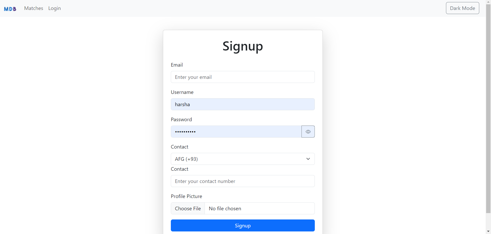
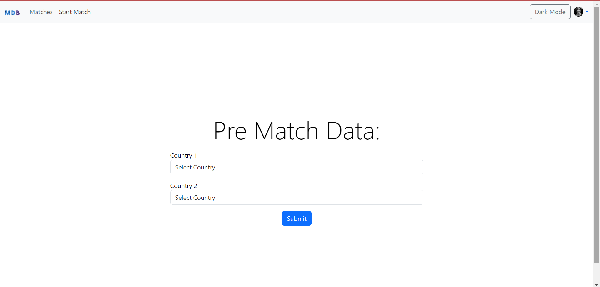

---

# Football Live Scoreboard

This repository contains an application for a **Football Live Scoreboard** using WebSocket technology, implemented with the help of the **socket.io** library.

## Overview

The application allows users to operate and view live football scores in real-time. It features several key interfaces:
- **Match Pre-Data Interface**: For setting up countries before the match starts.
- **Match Operator Interface**: For managing and updating the live scores along with flags.
- **Customer Interface**: For viewers to see the live scores along with flags.
- **User Authentication**: Allows admins and users to sign up, log in, and manage sessions.
- **Theme Toggle**: Switch between light and dark modes using a toggle button, powered by Context API and Bootstrap styles.

## Features

- Real-time score updates using WebSocket.
- Separate interfaces for operators and viewers.
- User-friendly design with Bootstrap for styling.
- Pre-match setup for selecting countries.
- User and admin authentication with JWT.
- NavBar with login, signup, and logout options.
- Theme toggle for switching between light and dark modes.

## Getting Started

### Prerequisites

Ensure you have the following installed on your machine:
- Node.js
- npm (Node Package Manager)

### Installation

1. Clone the repository:
    ```bash
    git clone https://github.com/Harshavignyan/FootBall.git
    ```

2. Navigate to the project directory:
    ```bash
    cd footballscoreboardapp
    ```

3. Install the dependencies:
    ```bash
    npm install
    ```

### Running the Application

1. Start the server:
    ```bash
    npm start
    ```

2. Open your web browser and navigate to the following URLs based on your role:

    - **Match Pre-Data**: [http://localhost:5173/prematchboard](http://localhost:5173/prematchboard)
    - **Match Operator**: [http://localhost:5173/operator](http://localhost:5173/operator)
    - **Viewer**: [http://localhost:5173/customer](http://localhost:5173/customer)
    - **Login**: [http://localhost:5173/login](http://localhost:5173/login)
    - **Signup**: [http://localhost:5173/signup](http://localhost:5173/signup)

## Usage

- **Match Pre-Data Interface**: Set up the countries playing the match by selecting from a dropdown menu at [http://localhost:5173/prematchboard](http://localhost:5173/prematchboard).
- **Match Operator Interface**: Update the scores live by sending requests to [http://localhost:5173/operator](http://localhost:5173/operator).
- **Customer Interface**: View the live scores in real-time at [http://localhost:5173/customer](http://localhost:5173/customer).
- **User Authentication**: Create users and admins, log in to the application, and manage sessions. The logout option clears the JWT token from local storage.
- **Theme Toggle**: Switch between light and dark modes using the theme toggle button located in the NavBar.

## Screenshots

### Signup Interface


### Login Interface


### Pre Match Data Interface


### Match Operator Interface


### Dashboard Interface


### On Toggle


## Dependencies

The project uses the following dependencies:

**Frontend:**
- `@reduxjs/toolkit`: "^2.2.7"
- `bootstrap`: "^5.3.3"
- `bootstrap-icons`: "^1.11.3"
- `formik`: "^2.4.6"
- `mdb-react-ui-kit`: "^8.0.0"
- `mdb-ui-kit`: "^7.3.2"
- `react`: "^18.3.1"
- `react-dom`: "^18.3.1"
- `react-redux`: "^9.1.2"
- `react-router-dom`: "^6.26.0"
- `socket.io-client`: "^4.7.5"
- `yup`: "^1.4.0"

**Backend:**
- `body-parser`: "^1.20.2"
- `cors`: "^2.8.5"
- `express`: "^4.19.2"
- `jsonwebtoken`: "^9.0.2"
- `mongoose`: "^8.5.2"
- `multer`: "^1.4.5-lts.1"
- `nodemon`: "^3.1.4"
- `socket.io`: "^4.7.5"

## Project Structure

- **public/**: Contains static files served by the server.
- **src/**: Contains React components and Redux slices.
- **server.js**: The main server file that sets up Express and socket.io.

## Routes

The following routes are available in the application:
- `/prematchboard`: For setting up countries before the match starts.
- `/operator`: For managing and updating live scores.
- `/customer`: For viewing live scores.
- `/login`: For logging in as a user or admin.
- `/signup`: For signing up as a user.
- `/dashboard`: Admin dashboard for managing the application.
- `/dashboard/signup`: For signing up as an admin.

## Author

**Harsha Vignyan Ayaluri**

## License

This project is licensed under the ISC License.

---
