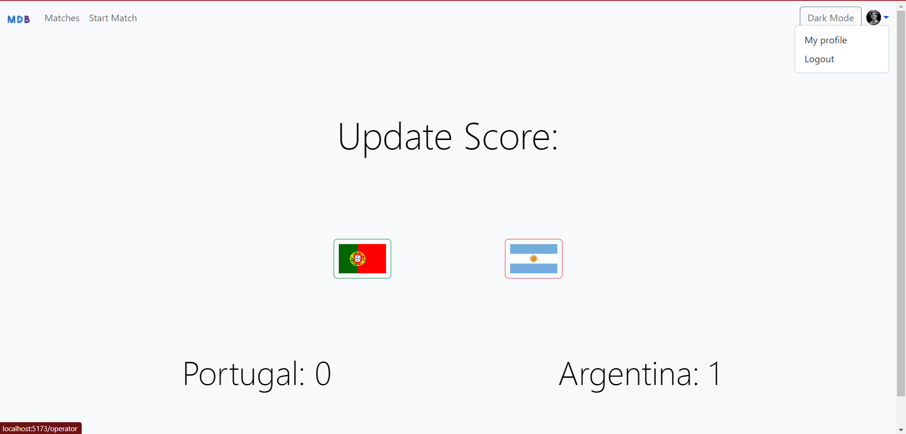

# Football Live Scoreboard

This repository contains an application for a **Football Live Scoreboard** using WebSocket technology, implemented with the help of the **socket.io** library.

## Overview

The application allows users to operate and view live football scores in real-time. It features three main interfaces:
- **Match Pre-Data Interface**: For setting up countries before the match starts.
- **Match Operator Interface**: For managing and updating the live scores along with flags.
- **Customer Interface**: For viewers to see the live scores along with flags.

## Features

- Real-time score updates using WebSocket.
- Separate interfaces for operators and viewers.
- User-friendly design with Bootstrap for styling.
- Pre-match setup for selecting countries.

## Getting Started

### Prerequisites

Ensure you have the following installed on your machine:
- Node.js
- npm (Node Package Manager)

### Installation

1. Clone the repository:
    ```bash
    git clone https://github.com/yourusername/footballscoreboardapp.git
    ```

2. Navigate to the project directory:
    ```bash
    cd footballscoreboardapp
    ```

3. Install the dependencies:
    ```bash
    npm install
    ```

### Running the Application

1. Start the server:
    ```bash
    npm start
    ```

2. Open your web browser and navigate to the following URLs based on your role:

    - **Match Pre-Data**: [http://localhost:5173/prematchboard](http://localhost:5173/prematchboard)
    - **Match Operator**: [http://localhost:5173/operator](http://localhost:5173/operator)
    - **Viewer**: [http://localhost:5173/customer](http://localhost:5173/customer)

## Usage

- **Match Pre-Data Interface**: Set up the countries playing the match by selecting from a dropdown menu at [http://localhost:5173/prematchboard](http://localhost:5173/prematchboard).
- **Match Operator Interface**: Update the scores live by sending requests to [http://localhost:5173/operator](http://localhost:5173/operator).
- **Customer Interface**: View the live scores in real-time at [http://localhost:5173/customer](http://localhost:5173/customer).

## Screenshots

### Pre Match Data Interface


### Match Operator Interface


### Customer Interface


## Dependencies

The project uses the following dependencies:

- **express**: Fast, unopinionated, minimalist web framework for Node.js
- **body-parser**: Node.js body parsing middleware
- **bootstrap**: Front-end component library for developing with HTML, CSS, and JS
- **nodemon**: Tool that helps develop Node.js applications by automatically restarting the node application when file changes are detected
- **socket.io**: Enables real-time bidirectional event-based communication

## Project Structure

- **public/**: Contains static files served by the server.
- **src/**: Contains React components and Redux slices.
- **server.js**: The main server file that sets up Express and socket.io.

## Routes

The following routes are available in the application:
- `/prematchboard`: For setting up countries before the match starts.
- `/operator`: For managing and updating live scores.
- `/customer`: For viewing live scores.


## Author

**Harsha Vignyan Ayaluri**

## License

This project is licensed under the ISC License.